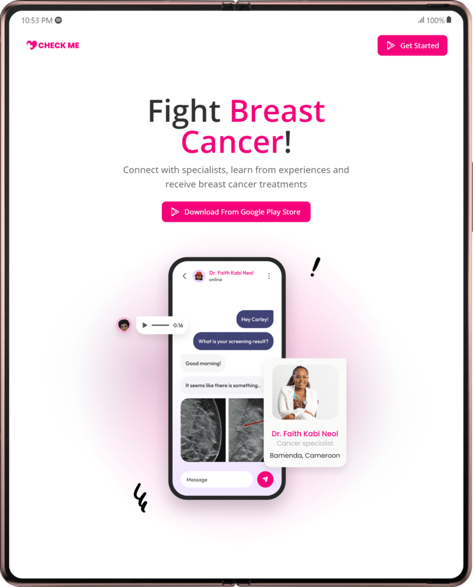

# React, Typescript, CSS, TailwindCSS

<div style="display:flex;gap:5rem;justify-content:center">


</div>

## Getting started

- ### Step 1 : Clone repo

```shell
   git clone https://github.com/bbrainttech/check-me-design.git

```

- ### Step 2 : install Dependences

```shell
   npm install
```

- ### Optional: create production build
  This create a `/dist` directory with production codes

```bash
npm run build
```

- ### Step 3 : Run server

```bash
   development server : npm run dev
   production server : npm run preview

```

### How to open old landing page design

This button in the New landing page opens the old design


